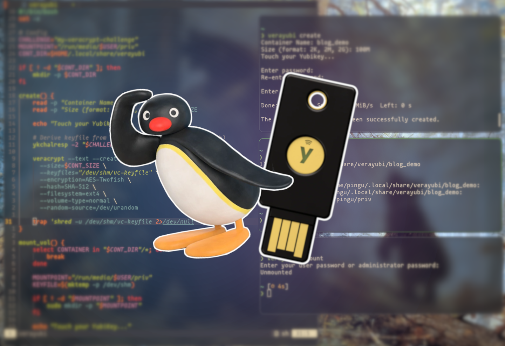

# Verayubi
Verayubi is a script for creating/managing VeraCrypt containers secured by a YubiKey-derived keyfile. FIDO hardware security for your container (on-top of your password)



### If you'd like to know more read my blog post @ [greyloot.ch](https://greyloot.ch/blog/yubikey-veracrypt-containers/)

---
### Prerequisites:

packages:

```bash
sudo pacman -S yubikey-manager veracrypt
```
program slot2 with challenge-response (backup the key, keep secret)

```bash
ykman otp chalresp --touch 2
```

provide your hex challenge for `CHALLENGE=` in the script you can generate it with:

```bash
openssl rand -hex 15
```
do not lose the challenge, you can hardcore it. it does not need to be kept secret.

> NOTE: Please use  a password with your container, your yubikey is an extra layer of security.
